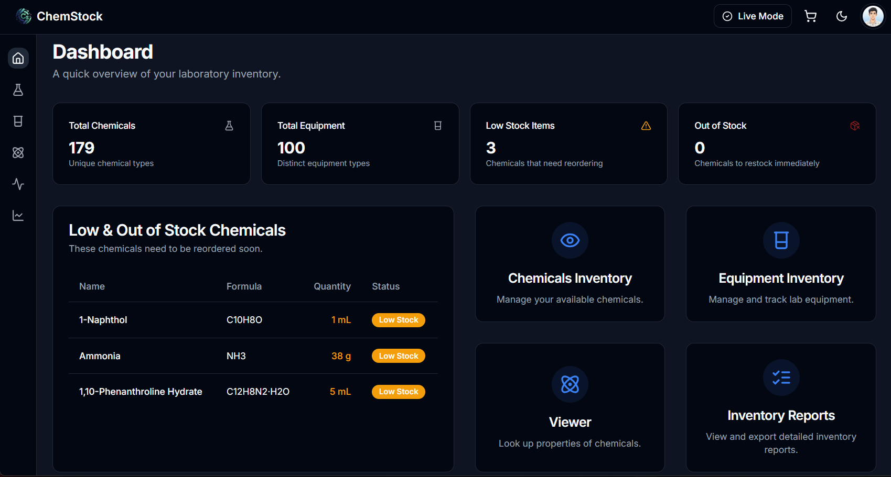
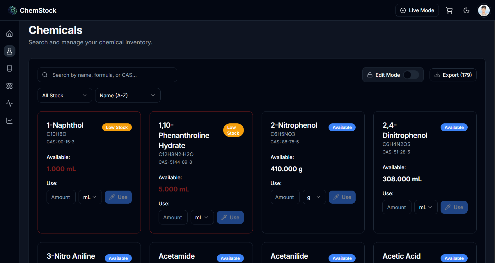
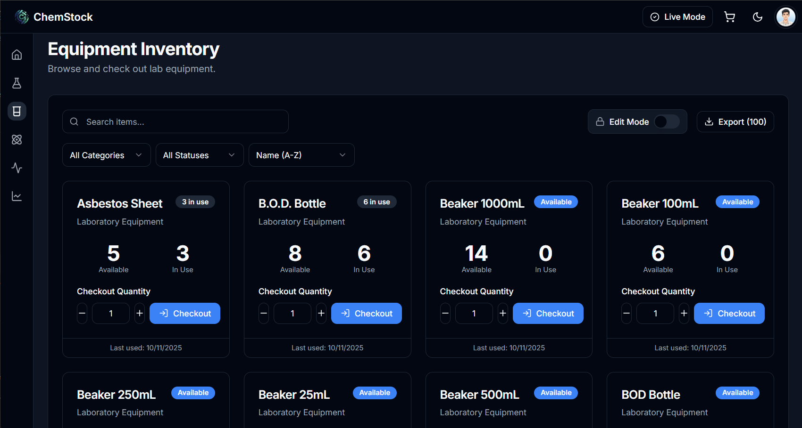
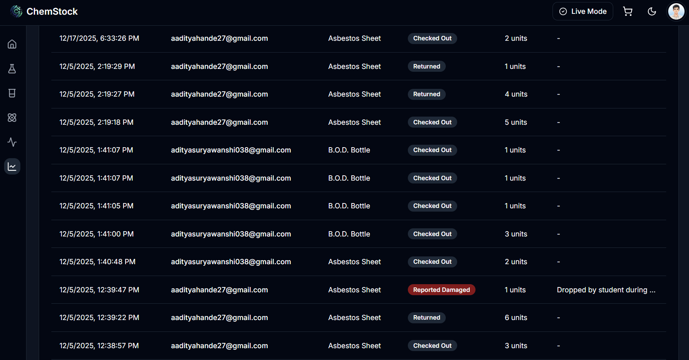
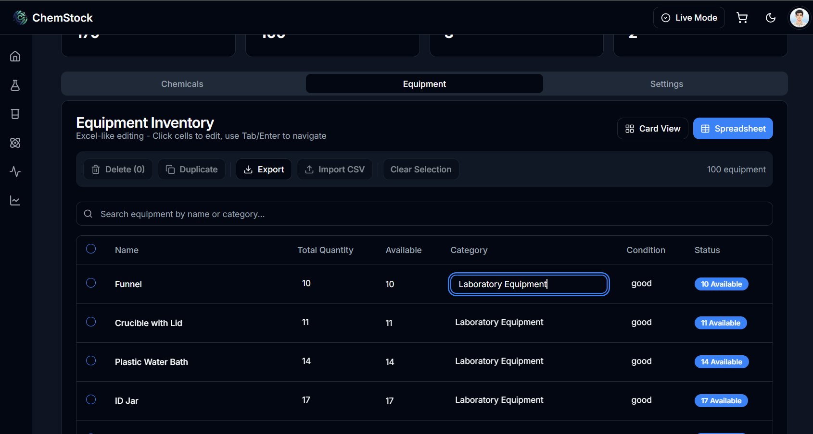

# 🧪 ChemStock — Chemical Laboratory Inventory Management System

A modern **Next.js-based inventory management system** for handling chemicals and laboratory equipment with **role-based access, real-time tracking, audit logs, and chemical data integration via PubChem API**.

> ⚠️ **ChemStock is actively used in a college chemistry laboratory.**

---

## ❓ Why ChemStock?

Most academic laboratories still manage chemicals and equipment using **manual registers or spreadsheets**, which leads to:

- Poor stock visibility
- No audit trail or accountability
- Safety risks due to expired or excess chemicals
- Time-consuming reporting

**ChemStock** digitizes laboratory workflows by providing **controlled access, real-time inventory tracking, audit logs, and structured reporting**, making lab operations **safer, transparent, and efficient**.

---

## ✨ Features

- 🔐 **Firebase Authentication**
  - Email/Password and Google Sign-In
  - Secure session handling

- 🔒 **Role-Based Access Control (RBAC)**
  - Admin and regular user roles
  - Permission-based feature access

- 🧪 **Chemical Viewer**
  - Real-time chemical search using **PubChem API**
  - Detailed chemical information

- 📦 **Chemical Inventory Management**
  - Quantity tracking
  - Low-stock and out-of-stock alerts
  - Usage history

- 🔧 **Equipment Management**
  - Equipment check-out / return system
  - Availability and usage tracking

- 🛒 **Reorder Cart**
  - Automatic low-stock detection
  - Manual chemical ordering support

- 📊 **Reports & Analytics**
  - Inventory reports
  - Usage reports
  - Audit reports

- 📈 **Activity & Audit Logs**
  - Complete audit trail of inventory actions
  - User-wise activity tracking

- 💾 **Database Backup & Restore**
  - Full Firestore backup
  - Restore functionality (Admin only)

- ⚡ **Edit Mode Protection**
  - Admin-only edit controls
  - Prevents accidental modifications

- 📥 **CSV Export**
  - Export chemicals, equipment, and reports

- 🌙 **Dark Mode**
  - Theme toggle
  - System preference detection

- 📱 **Responsive Design**
  - Optimized for desktop, tablet, and mobile

- 🔍 **Advanced Search**
  - Real-time filtering and sorting

- 🚨 **Stock Alerts**
  - Automatic notifications for low / empty stock

---

## 🖼️ Screenshots

> Real screenshots from the deployed ChemStock system used in a college chemistry laboratory.

### 📊 Dashboard Overview


### 🧪 Chemical Inventory Management


### 🔍 Chemical Viewer 


### 🔧 Equipment Management


### 📈 Reports & Audit Logs


### ⚙️ Admin Panel & Backup


### + view more 
[in screenshots folder](./screenshots/)

---

## 🚀 Setup & Installation

### 1️⃣ Install Dependencies
```bash
npm install
````

---

### 2️⃣ Firebase Configuration

Refer to:
📄 **[FIREBASE_SETUP.md](./docs/FIREBASE_SETUP.md)**

Quick overview:

1. Create a Firebase project
2. Enable Email/Password & Google authentication
3. Set up Firestore database
4. Add authorized users

---

### 3️⃣ Environment Variables

```bash
cp .env.example .env.local
```

Update `.env.local` with:

* Firebase credentials
* Authorized email IDs

---

### 4️⃣ Run Development Server

```bash
npm run dev
```

Open 👉 [http://localhost:9002](http://localhost:9002)

---

## 🔐 Authentication Rules

* Only emails listed in `NEXT_PUBLIC_ALLOWED_EMAILS` can access the app
* Users can log in using Email/Password or Google
* Unauthorized users are automatically logged out

---
## 🏗 Project Structure

```
src/
├── ai/                      # AI and Genkit integration
├── app/
│   ├── (auth)/              # Authentication pages (login, register)
│   ├── (dashboard)/         # Protected dashboard routes
│   │   ├── activity/        # Activity & audit logs
│   │   ├── admin/           # Admin panel (reports, backup, settings)
│   │   ├── cart/            # Reorder cart management
│   │   ├── chemical-viewer/ # PubChem chemical search
│   │   ├── chemicals/       # Chemical inventory
│   │   ├── dashboard/       # Main dashboard overview
│   │   ├── equipment/       # Equipment checkout system
│   │   ├── init-db/         # Database initialization
│   │   ├── reports/         # Reports & analytics
│   │   ├── settings/        # User preferences
│   │   └── support/         # Support pages
│   ├── api/                 # API routes (Next.js Route Handlers)
│   ├── home/                # Landing page
│   ├── globals.css          # Global styles
│   └── layout.tsx           # Root layout & providers
├── components/
│   ├── ui/                  # shadcn/ui components
│   ├── animated-grid.tsx    # Animated grid component
│   ├── ErrorBoundary.tsx    # Error boundary
│   ├── floating-icons.tsx   # Floating icons
│   ├── icons.tsx            # Icon components
│   ├── offline-indicator.tsx# Offline status indicator
│   ├── ProtectedRoute.tsx   # Route protection
│   ├── theme-provider.tsx   # Theme context/provider
│   ├── theme-toggle.tsx     # Theme toggle button
│   ├── TrialModeToggle.tsx  # Trial mode toggle
│   └── context/             # (If present) Custom context providers
├── contexts/
│   ├── AuthContext.tsx      # Authentication state/context
│   └── FirestoreContext.tsx # Firestore data context
├── hooks/                   # Custom React hooks
│   ├── use-mobile.tsx
│   └── use-toast.ts
├── lib/
│   ├── auditLog.ts          # Audit logging
│   ├── data.ts              # Data utilities
│   ├── firebase.ts          # Firebase configuration
│   ├── initialData.ts       # Initial data for DB
│   ├── placeholder-images.json
│   ├── placeholder-images.ts
│   └── utils.ts             # Helper functions
└── public/                  # Static assets (PWA, images, etc.)
```
---

## 🧰 Tech Stack

* **Next.js 15.5.7** — App Router
* **TypeScript** — Type-safe development
* **Firebase** — Authentication & Firestore
* **Tailwind CSS** — Utility-first styling
* **shadcn/ui** — Accessible UI components
* **PubChem API** — Chemical data
* **PWA** — Offline-ready support

---

## 📚 Documentation

* 🔧 **[Firebase Setup Guide](./docs/FIREBASE_SETUP.md)**
* 🛂 **[Role Permissions](./docs/ROLESINFO.md)**

---

## 🤝 Collaboration

ChemStock is a collaborative project built through close teamwork and mutual effort.  
Both contributors have been involved in designing, building, improving, and refining the system over time — from early UI development to feature expansion and ongoing enhancements.

The project reflects shared responsibility, shared learning, and shared ownership, with work evolving naturally as the system grew in scope and complexity.

**Contributors:**
- **Aaditya Hande** — GitHub: [@AadityaHande](https://github.com/AadityaHande)
- **Aditya Suryawanshi** — GitHub: [@Aditya00038](https://github.com/Aditya00038)

---

**ChemStock** — enabling **safe, auditable, and efficient laboratory inventory management**.
